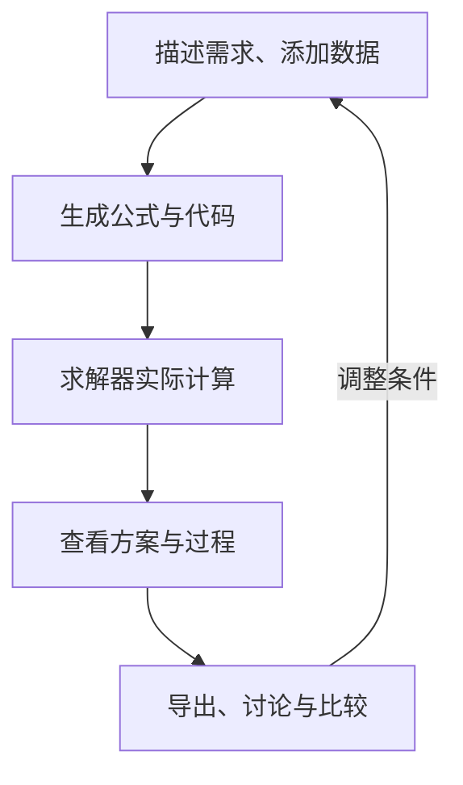

通用智能优化求解器（General Intelligent Optimization Solver）是一个求解各种复杂优化问题的通用求解器，将自然语言问题和业务数据转成数学优化模型，并调用求解器计算最优方案。你可以从描述需求开始，查看具体决策与建模过程，再通过对话调整条件、比较方案并导出结果。

## 选择你的使用入口

| 入口 | 适合怎样开始 | 接下来能做什么 |
|---|---|---|
| [优化对话](../chat-agent/) | 直接发送问题或想法 | 补充需求、计算、查询、调整与场景比较 |
| [手动建模](../run-settings/) | 已有完整题面和数据 | 编辑输入、选择配置、启动并查看过程 |
| [需求助手](../requirements/) | 业务想法仍在整理 | 形成可编辑需求稿与附件，再交给建模 |

## 从这里开始

1. **已有可访问的平台**：按[快速开始](../quickstart/)求解一个有明确答案的生产案例，再核对模型和结果。
2. **需要搭建平台**：先[安装与启动](../installation/)，配置[模型预设](../model-presets/)，再完成快速开始。
3. **准备处理真实业务**：明确决策、目标、约束、单位和数据来源。信息不完整时，先用[需求助手](../requirements/)确认，避免让模型替你补造规则。

页面或运行出现问题时，从[故障排查](../troubleshooting/)按现象查找检查步骤。

## 从需求到可使用的方案

```mermaid
flowchart TB
  Input["描述需求、添加数据"] --> Model["生成公式与代码"]
  Model --> Solve["求解器实际计算"]
  Solve --> Result["查看方案与过程"]
  Result --> Use["导出、讨论与比较"]
  Use -->|调整条件| Input
```

一次运行保存题面、附件、配置、公式、代码、实际变量和步骤。可以在同一任务中保留原方案与后续变更，查看每份结果的来历。

模型负责将题意表达成公式和代码；默认 Docker Worker 负责执行生成代码、调用求解器。求解器报告“最优”，表示当前数学模型达到最优，仍须核对它是否准确表达业务规则。文档中的交互示例使用有限的小问题计算，不代表平台对任意问题的性能或正确性保证。

## 日常功能怎样配合

| 你想完成的事 | 文档入口 |
|---|---|
| 把表格带进问题，修改字段与数值 | [上传与编辑数据](../attachments/) |
| 看具体产量、排班或分配结果 | [查看与导出结果](../results/) |
| 查询某个决策、合计费用 | [讨论方案](../plan-chat/) |
| 改一项要求，得到新方案 | [调整条件](../revisions/) |
| 比较多个预算、需求或资源条件 | [业务场景](../scenarios/) |
| 查找旧任务，记录结论与分享 | [历史、标签与报告](../history/) |

## 理解平台怎样建模和计算

[建模方法](../methods/)介绍13种流程，每种有机制说明、Mermaid流程图、逐步案例和当前参数。可以了解一次生成、反馈修复、分层验证、类型检索、组件搜索与数据绑定的具体做法。

[建模库与求解器](../solvers/)按数学结构介绍9个库、原生接口、后端选择和完整代码。生产、排班、指派、凸二次和非线性案例可帮助你找到合适的计算路径。

## 看实际操作，也可以动手尝试

文档包含对应语言的工作台录屏、截图和交互示例。快速开始可下载数据并跟随操作；方法文章可逐步查看输入、中间产物和反馈；求解器案例可改变参数并查看计算结果。

界面支持中文、英文及浅色、深色和跟随系统外观。桌面可拖动分隔线调整阅读区域，窄屏通过页签切换主要内容与助手。

中文模式下，新建运行要求模型直接使用中文说明。英文原题和历史英文模型可显示缓存的阅读译文；切换语言不会改写原题、代码或保存记录。运行中的阶段名称随界面语言显示，模型原始输出可按需展开，其中可能含英文、代码和工具字段。详见[语言与显示问题](../troubleshooting/)。

## 团队与脚本工作流

[团队部署](../team-deployment/)介绍共享服务、HTTPS和访问配置；[用量与备份](../configuration/)介绍额度、并发和数据维护。需要接入已有程序，可使用[命令行与Python](../cli-python/)运行同一套建模流程。

通用智能优化求解器由 [EIPI团队](https://scut-eipi.github.io/)开发，源码与文档持续公开维护。
